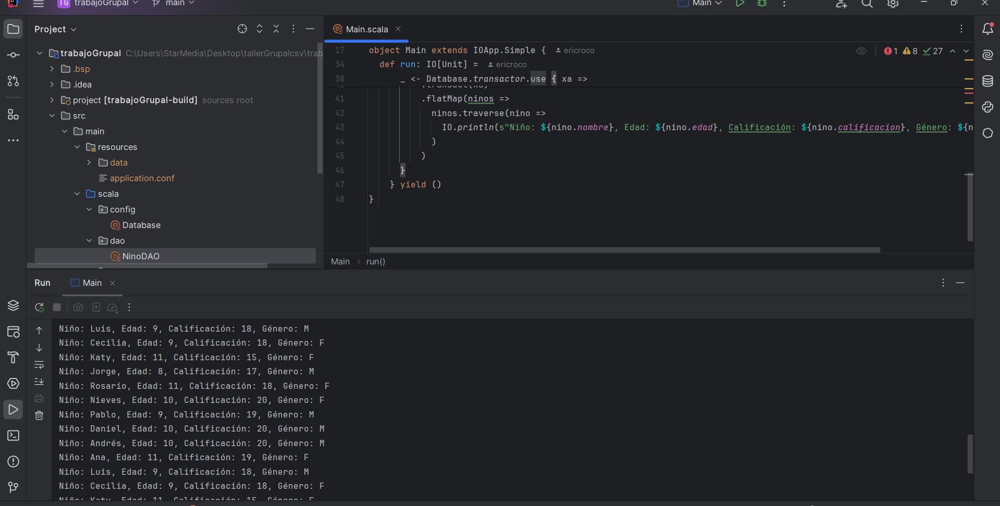

# Proyecto Scala: Manejo de Datos con Doobie y Cats Effect

Este proyecto es un ejemplo de cómo manejar datos de una base de datos en Scala utilizando Doobie para las consultas y Cats Effect para la gestión de efectos y transacciones. El enfoque principal es manejar datos relacionados con estudiantes (nombre, edad, calificación y género) desde una tabla en la base de datos.

### Tecnologías Utilizadas

Scala (versión 2.13.12)

Doobie: Librería para interacción con bases de datos mediante JDBC.

Cats Effect: Gestión de efectos funcionales.

HikariCP: Conexión eficiente a la base de datos.

Estructura del Proyecto

### Modelos

El modelo principal es Nino, que representa un registro en la tabla estudiantes:
```scala
case class Nino(
  nombre: String,
  edad: Int,
  calificacion: Int,
  genero: String
)
```

### DAO (Data Access Object)
El objeto NinoDAO contiene las funciones necesarias para interactuar con la base de datos:
Inserta un solo registro en la tabla "ninos"
```scala
  def insert(nino: Nino): ConnectionIO[Int] = {
    sql"""
     INSERT INTO ninos (nombre, edad, calificacion, genero)
     VALUES (
       ${nino.nombre},
       ${nino.edad},
       ${nino.calificacion},
       ${nino.genero}
     )
   """.update.run
  }
```

select: Recupera todos los registros de la tabla ninos.
```scala
object NinoDAO {
  def select(): ConnectionIO[List[Nino]] = {
    sql"""
      SELECT nombre, edad, calificacion, genero
      FROM ninos
    """.query[Nino].to[List]
  }
}
```
### Configuración de la Base de Datos

El transactor para manejar las conexiones se configura en el objeto Database:
```scala
object Database {
  private val connectEC: ExecutionContext = ExecutionContext.global

  def transactor: Resource[IO, HikariTransactor[IO]] = {
    val config = ConfigFactory.load().getConfig("db")
    HikariTransactor.newHikariTransactor[
      IO
    ](
      config.getString("driver"),
      config.getString("url"),
      config.getString("user"),
      config.getString("password"),
      connectEC
    )
  }
}
```
### Main

El método principal llama a NinoDAO.select() para recuperar los datos y los imprime en consola:
```scala
object Main extends IOApp {
  def run: IO[Unit] =
    for {
      _ <- NinoDAO.insertAll(ninos)
        .flatMap(result => IO.println(s"Registros insertados: ${result.size}"))
      _ <- Database.transactor.use { xa =>
        NinoDAO.select()
          .transact(xa)
          .flatMap(ninos =>
            ninos.traverse(nino =>
              IO.println(s"Niño: ${nino.nombre}, Edad: ${nino.edad}, Calificación: ${nino.calificacion}, Género: ${nino.genero}")
            )
          )
      }
    } yield ()
}
```
### Tabla de Base de Datos

```SQL
CREATE TABLE estudiantes (
    id SERIAL PRIMARY KEY,
    nombre VARCHAR(50),
    edad INT,
    calificacion INT,
    genero CHAR(1)
);
```



### Consideraciones

Dependencias: Asegúrate de tener las dependencias de Doobie, Cats Effect y HikariCP en tu archivo build.sbt.

Error Handling: Actualmente, no incluye un manejo avanzado de errores. Puedes agregarlo según las necesidades de tu aplicación.

Futuras Mejoras

Agregar métodos para insertar, actualizar y eliminar registros.

Implementar pruebas unitarias para las funciones de DAO.

Integrar un sistema de logging para monitorear las operaciones.


